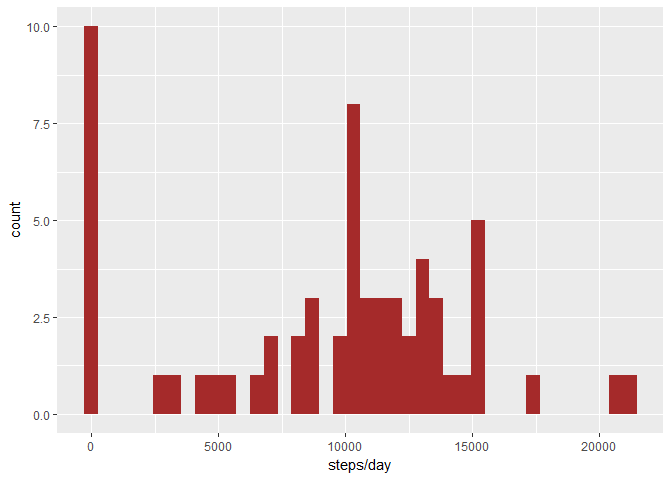

# Reproducible Research: Peer Assessment 1


## Loading and preprocessing the data

This section reads the data from the csv file and groups the data by date.


```r
 # Read the data into a dataframe. This assumes the "activity.csv" is downloaded into the working folder
 steps <- read.csv("activity.csv", header = TRUE, na.strings = "NA", sep = ",")
 library(dplyr, quietly = TRUE, verbose = FALSE)
```

```
## 
## Attaching package: 'dplyr'
```

```
## The following objects are masked from 'package:stats':
## 
##     filter, lag
```

```
## The following objects are masked from 'package:base':
## 
##     intersect, setdiff, setequal, union
```

```r
 # Group and total the steps by day
 steps_day <- group_by(steps, date)
 steps_daytotal <- summarise(steps_day, totalsteps=sum(steps, na.rm = TRUE))
```

## What is mean total number of steps taken per day

The histogram below shows the total steps per day


```r
 library(ggplot2, quietly = TRUE)
 # Plot the histogram for all the days
 ggplot(steps_daytotal, aes(totalsteps)) + geom_histogram(bins=40, fill="brown")  + labs(x="steps/day")
```

<!-- -->

```r
 # Calculate the mean and median value of steps per day
 dailymean <- round(mean(steps_daytotal$totalsteps),0)
 dailymedian <- median(steps_daytotal$totalsteps)
```
 
The mean number of steps per day is **9354**.

The median of the number of steps per day is **10395**.


## What is the average daily activity pattern?

This time series graph plots the mean steps of each interval as measured across days.


```r
 # Group steps for each interval  and calculate mean steps per interval
 steps_int <- group_by(steps, interval)
 int_avg <- summarise(steps_int, meansteps=mean(steps, na.rm = TRUE))
 # Plot the time series of average steps for all intervals
 ggplot(int_avg, aes(x=interval, y=meansteps))+geom_line()+ labs(y="average  steps/interval") + scale_x_continuous(breaks = seq(min(int_avg$interval),   max(int_avg$interval), by=200))
```

<!-- -->

```r
 #Calculate the interval with the maximum steps 
 max_int <- filter(int_avg, meansteps==max(meansteps))$interval
 max_steps <- round(filter(int_avg, meansteps==max(meansteps))$meansteps,0)
```

The time interval that has the maximum number of steps, on average across all days of the dataset is **835** and the steps for that interval are **206**. 


## Imputing missing values

This section tries to determine the effect of missing values on the results shown previously. 

The number of missing observations in the dataset are **2304**.

Now, let us replace NA values with the mean values across days for those intervals, and compare this histogram with the earlier one.


```r
 # Add a new column that contains mean values of each interval across all days
 steps_int <- mutate(steps_int, meansteps=mean(steps, na.rm = TRUE))
 # Add a new column that replaces NA values of steps with the mean value for  that interval
 steps_int <- mutate(steps_int, finalsteps=ifelse(is.na(steps), meansteps, steps))
 steps <- cbind(steps, finalsteps=steps_int$finalsteps)
 # Calculate steps per day using the filled in values of steps
 nstep_d <- group_by(steps, date)
 nstep_dt <- summarise(nstep_d, daytotal=sum(finalsteps, na.rm = TRUE))
 
 # Plot compartive histograms between the raw step counts and the filled in data series
 library(gridExtra, quietly = TRUE)
```

```
## 
## Attaching package: 'gridExtra'
```

```
## The following object is masked from 'package:dplyr':
## 
##     combine
```

```r
 plot1 <- ggplot(steps_daytotal, aes(totalsteps)) + geom_histogram(bins=40, fill="brown") + labs(x="steps/day")+ggtitle("Steps ignoring NA values")

 plot2 <- ggplot(nstep_dt, aes(daytotal)) + geom_histogram(bins=40, fill="blue") + labs(x="steps/day")+ ggtitle("Step counts after imputing NA values")

 grid.arrange(plot1, plot2, ncol=2)
```

<!-- -->


```r
 # Calculate the mean and median steps per day using the filled in dataset 
 newdailymean <- as.integer(mean(nstep_dt$daytotal, na.rm = TRUE))
 newdailymed <- as.integer(median(nstep_dt$daytotal, na.rm = TRUE))
```

The new daily mean is **10766** as against the earlier mean value of **9354**. The new daily median is **10766** as compared to the earlier median value of **10395**. 


## Are there differences in activity patterns between weekdays and weekends?

This section examines mean steps for each interval across weekdays as compared with weekends. The panel plot below compares the mean steps for weekdays and weekends for all intervals.


```r
 # Add a new factor variable indicating if the observation is for the weekday or weekend.    
 steps <- mutate(steps,daytype=ifelse(weekdays(as.Date(date))=="Sunday"|weekdays(as.Date(date))=="Saturday", "weekend", "weekday"))
 steps$daytype <- as.factor(steps$daytype)
 # Calculate mean steps for each interval, for weekdays and weekends separately
  nstep_int <- group_by(steps, daytype, interval)
  summary_int <- summarise(nstep_int, meansteps=mean(finalsteps,na.rm = TRUE))
  # Plot the time series for the weekdays and weekends
  ggplot(summary_int, aes(x=interval, y=meansteps)) + geom_line() + facet_grid(. ~ daytype) + labs(x="Interval", y="Average steps") + ggtitle("                                   Steps/interval time series") + theme_bw()
```

<!-- -->
 
 
The trend appears to indicate a higher level of activity on weekends, starting later in the day. 

****
